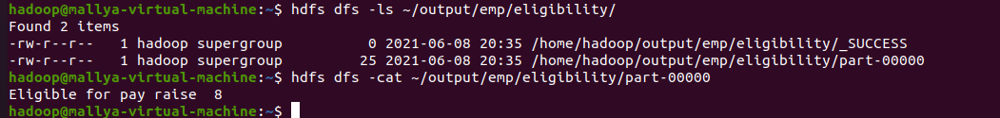
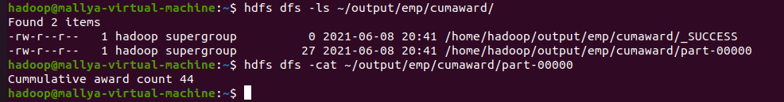
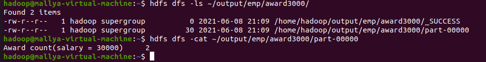
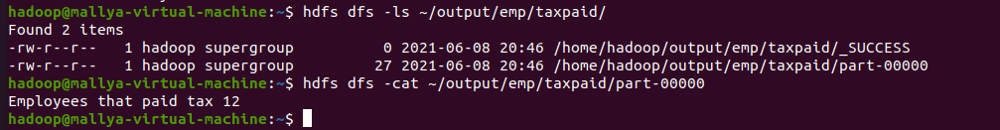

# Learning Component - II

## Exercise-I

### Outputs

#### 1. Total number of employees who are eligibile for pay raise

#### 2. Total number of cummulative awards the company had this year

#### 3. How many total awards were obtained by the employee whose salary is 30000 ?

#### 4. Count the number of employees who had paid the Tax.

